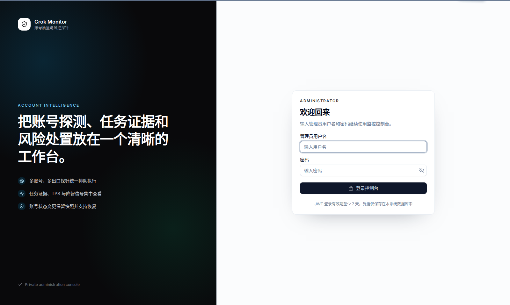

# Grok Account Monitor

> 独立的 grok_build 账号质量探针、任务调度与风险处置工作台。


Grok Account Monitor 通过 grok2api 管理 API 实时读取账号和出口，使用多轮、多出口探针采集 TPS、首 Token、生成窗口、输出 Token、预期匹配、完整回复与审计核验等证据，用于识别持续高速但回复质量明显下降的账号。

- **不修改 grok2api**，也不复制它的账号表或出口表。
- grok2api 始终是账号、凭据、额度、出口绑定与启停状态的事实源。
- 本项目使用 ORM 保存探针方案、Cron 计划、持久任务、样本证据、风险判断、恢复记录与运行时设置。
- 可独立运行，也可接收 grok-register Webhook，在账号导入后自动创建探针任务。

## 界面预览

> 截图全部使用合成数据：邮箱为 `example.com`，IP 使用 RFC 示例地址段，不包含真实账号、Token、代理或数据库内容。点击图片可查看原图。

<p align="center">
  <a href="docs/screenshots/monitoring-overview.png">
    
  </a>
  <br />
  <sub>监控概览：账号规模、风险数量、样本、TPS 趋势、队列与风险排行</sub>
</p>

### 日常监控与调度

<table>
  <tr>
    <td width="50%" valign="top">
      <a href="docs/screenshots/account-probes.png"></a><br />
      <sub><b>账号探针</b> · 实时账号状态、监控判定、TPS、出口与批量操作</sub>
    </td>
    <td width="50%" valign="top">
      <a href="docs/screenshots/task-center.png"></a><br />
      <sub><b>任务中心</b> · 持久队列、进度、Worker、统计、重测、停止与删除</sub>
    </td>
  </tr>
  <tr>
    <td width="50%" valign="top">
      <a href="docs/screenshots/worker-runtime.png"></a><br />
      <sub><b>Worker 运行状态</b> · 进程、并发实例、当前任务与队列阻塞</sub>
    </td>
    <td width="50%" valign="top">
      <a href="docs/screenshots/worker-logs.png"></a><br />
      <sub><b>Worker 日志</b> · 最近日志按行读取，页面最多展示 1500 行</sub>
    </td>
  </tr>
  <tr>
    <td width="50%" valign="top">
      <a href="docs/screenshots/cron-schedules.png"></a><br />
      <sub><b>Cron 调度</b> · 标准五段表达式、独立时区、重叠策略与调用记录</sub>
    </td>
    <td width="50%" valign="top">
      <a href="docs/screenshots/probe-profiles.png"></a><br />
      <sub><b>探针方案</b> · 系统内置基线与用户自定义方案分开管理</sub>
    </td>
  </tr>
  <tr>
    <td colspan="2" valign="top">
      <a href="docs/screenshots/chat-playground.png"></a><br />
      <sub><b>聊天广场</b> · 多提供商、思考过程、流式正文、本地历史、Markdown 与 HTML 预览</sub>
    </td>
  </tr>
</table>

### 任务证据与编辑流程

<table>
  <tr>
    <td width="50%" valign="top">
      <a href="docs/screenshots/account-detail.png"></a><br />
      <sub><b>账号详情</b> · 风险原因、出口对比、最近任务和样本证据</sub>
    </td>
    <td width="50%" valign="top">
      <a href="docs/screenshots/run-detail.png"></a><br />
      <sub><b>任务详情</b> · 原设置恢复、每轮指标、分类和折叠响应</sub>
    </td>
  </tr>
  <tr>
    <td width="50%" valign="top">
      <a href="docs/screenshots/html-preview.png"></a><br />
      <sub><b>HTML 全屏预览</b> · 预览与源码切换，无额外前景遮罩</sub>
    </td>
    <td width="50%" valign="top">
      <a href="docs/screenshots/expected-output-editor.png"></a><br />
      <sub><b>预期结果编辑器</b> · 长文本、Markdown、HTML 与 SVG 渲染预览</sub>
    </td>
  </tr>
  <tr>
    <td width="50%" valign="top">
      <a href="docs/screenshots/profile-editor.png"></a><br />
      <sub><b>方案编辑</b> · 提示词、模型、自动校验标记和输出参考</sub>
    </td>
    <td width="50%" valign="top">
      <a href="docs/screenshots/cron-plan-editor.png"></a><br />
      <sub><b>Cron 计划编辑</b> · 实时搜索、多选账号、方案、轮次与出口</sub>
    </td>
  </tr>
  <tr>
    <td width="50%" valign="top">
      <a href="docs/screenshots/playground-provider-settings.png"></a><br />
      <sub><b>聊天提供商</b> · 多套 Base URL、API Key 与模型列表</sub>
    </td>
    <td width="50%" valign="top">
      <a href="docs/screenshots/decision-guide.png"></a><br />
      <sub><b>判定说明</b> · 样本分类、风险累计、任务状态与恢复状态说明</sub>
    </td>
  </tr>
</table>

### 系统设置与登录

<table>
  <tr>
    <td width="50%" valign="top">
      <a href="docs/screenshots/settings-connection.png"></a><br />
      <sub><b>连接与凭据</b> · grok2api 地址、管理员凭据与数据边界</sub>
    </td>
    <td width="50%" valign="top">
      <a href="docs/screenshots/settings-queue.png"></a><br />
      <sub><b>任务队列</b> · Worker 并发、容量、重试与诊断设置</sub>
    </td>
  </tr>
  <tr>
    <td width="50%" valign="top">
      <a href="docs/screenshots/settings-risk.png"></a><br />
      <sub><b>风险与隔离</b> · 降智信号区间、连续次数与自动停用</sub>
    </td>
    <td width="50%" valign="top">
      <a href="docs/screenshots/integration-settings.png"></a><br />
      <sub><b>联动与启动项</b> · grok-register Webhook 和导入后初始探针</sub>
    </td>
  </tr>
  <tr>
    <td width="50%" valign="top">
      <a href="docs/screenshots/sign-in.png"></a><br />
      <sub><b>管理员登录</b> · JWT 鉴权的独立管理控制台</sub>
    </td>
    <td width="50%" valign="top">
      <a href="docs/screenshots/first-time-setup.png"></a><br />
      <sub><b>首次使用</b> · 创建唯一管理员后进入系统</sub>
    </td>
  </tr>
</table>

## 核心能力

### 1. 实时账号视图

- 账号和出口均通过 grok2api 管理 API 实时读取。
- 支持按账号名称、邮箱、ID、上游状态、监控判定和恢复状态筛选。
- 支持当前页选择、全选当前服务端筛选结果、批量启用、批量停用和批量创建测试。
- 本地只叠加历史风险判断，不保存账号凭据或账号镜像。

### 2. 两种探针模式

| 模式 | 调用链路 | 适用场景 | 保存证据 |
| --- | --- | --- | --- |
| 完整对话探针 `chat` | 临时固定目标账号与出口，再调用 `/v1/chat/completions` | 正文质量、HTML/Markdown、指令遵循、预期效果对比 | 完整回复、流式时序、Token、TPS、预期匹配、审计记录 |
| 快速出口质量探针 `quality_test` | 创建临时单账号路由与 Client Key，调用 grok2api 的出口 `quality-test` | 多出口快速筛查 | 指标、响应哈希、实际账号与出口审计核验 |

完整模式可选择“上游调度”或一个、多个固定出口。“上游调度”表示临时解除账号的固定出口绑定，由 grok2api 选择当前可用出口；任务仍会记录审计中的实际出口。

快速模式不会修改账号当前出口绑定，但必须选择 grok2api 中**已启用且配置了代理**的出口节点。

### 3. 持久任务队列

- 手动探针与 Cron 计划共用 SQLAlchemy ORM 持久队列。
- 批量账号使用单次 API 和 ORM 事务快速入队，支持数千账号排队。
- 固定 Worker 数量限制全局并发；不同账号可并行，同一账号始终串行。
- 支持排队、执行、取消中、完成、部分异常、失败和已取消等任务状态。
- 支持批量重测、批量停止、批量删除、搜索和服务端分页。
- 进程重启后恢复中断任务，并清理临时路由、Client Key 与账号诊断设置。

### 4. 风险判断与账号恢复

单次高 TPS 只记录一个信号，不直接等同账号最终降智。账号判定会组合：

- 降智信号 TPS 起点与强降智信号 TPS 起点。
- 首 Token 占总耗时比例、实际生成窗口与最低输出 Token。
- 自动校验标记是否命中。
- 同账号连续异常次数。
- 异常是否跨越多个出口。

达到配置条件后可通过 grok2api 暂时停用账号。任务永久记录原启用状态、优先级、最大并发与出口绑定；请求结束后自动恢复。恢复失败时会保留“待人工同步”标记，可在任务详情按记录重新同步。

### 5. Cron、Worker 与日志

- 每个计划使用标准五段 Cron 表达式和独立时区。
- 支持“前批未结束则跳过”或“仅补足无活动任务账号”。
- 短周期 Cron 只负责创建容量受限的持久任务，不直接无限启动探针协程。
- Worker 页面展示后端 PID、每个 Worker 的忙闲状态、当前任务和阻塞原因。
- Worker 日志按 UTC 每日轮转，默认保留 2 天；前端最多读取 1500 行。

### 6. 聊天广场与正向对比

- 支持配置多套兼容 `/v1/chat/completions` 的提供商、Base URL、API Key 与模型列表。
- 支持思考过程与正文的流式输出、停止、重新生成、多回复版本和复制。
- 会话使用 IndexedDB 持久化，并在 IndexedDB 不可用时回退到 localStorage。
- 支持载入探针方案、Markdown、HTML/SVG 预览和预期结果对照。

## 项目边界

| 数据或职责 | grok2api | Grok Account Monitor |
| --- | --- | --- |
| 账号凭据、OAuth、额度 | 事实源 | 不复制 |
| 账号启停、优先级、最大并发 | 事实源 | 通过 API 临时调整并记录恢复证据 |
| 出口节点与代理配置 | 事实源 | 实时读取，不建镜像表 |
| 探针方案、Cron 计划 | — | ORM 持久化 |
| 任务、样本、完整回复、风险判断 | — | ORM 持久化 |
| grok-register 注册流程 | 只发送 Webhook | 接收入库并按配置创建探针 |

## 技术架构

```mermaid
flowchart LR
    UI[React / shadcn-admin] -->|JWT + /api| API[FastAPI]
    API --> AUTH[管理员鉴权]
    API --> ORM[(SQLAlchemy ORM)]
    API --> SCHED[APScheduler]
    API --> QUEUE[持久任务队列]
    QUEUE --> W1[Worker 1]
    QUEUE --> W2[Worker 2..N]
    W1 --> G2[grok2api 管理 API]
    W2 --> G2
    W1 --> CHAT[/v1/chat/completions]
    W2 --> CHAT
    G2 --> AUDIT[请求审计]
    REG[grok-register] -->|Webhook 202| API
```

### 后端包层级

```text
backend/app/
├── core/                    # 启动配置、日志与安全基础设施
├── integrations/grok2api/  # grok2api API 适配
├── persistence/             # ORM 模型、Session 与 Repository
├── services/                # 账号、探针、队列、调度与设置用例
├── web/                     # FastAPI Router、Depends 与输入输出 Schema
├── analyzer.py              # 样本分类和风险规则
└── main.py                  # 组合根与应用生命周期
```

### 技术栈

- **后端**：Python 3.11+、FastAPI、SQLAlchemy、Alembic、APScheduler、curl_cffi、SQLite。
- **前端**：React 19、TypeScript、Vite、TanStack Router/Query、shadcn/ui、Tailwind CSS。
- **前端基础**：基于 [satnaing/shadcn-admin](https://github.com/satnaing/shadcn-admin) 二次开发，页面密度与菜单布局参考 new-api。
- **部署**：Docker、Docker Compose、Nginx，可选 Caddy 反向代理。

## Docker Compose 快速开始

### 1. 准备配置

```bash
cp .env.example .env
```

默认假设 grok2api 运行在宿主机 `8000` 端口。可先在 `.env` 填写连接，也可启动后在前端“系统设置”中配置。

### 2. 使用已发布镜像

```bash
docker compose pull
docker compose up -d
```

### 3. 或从当前源码构建

```bash
docker compose up -d --build
```

访问地址：

- 前端：`http://127.0.0.1:8091`
- 后端健康检查：`http://127.0.0.1:8090/api/health`

首次访问会显示“创建管理员”。完成后进入系统设置，填写 grok2api 服务地址、管理员用户名和密码，再保存并测试连接。

Compose 使用命名卷 `monitor-data` 保存：

- `monitor.db`
- 自动生成的 `monitor.settings.key`
- 自动生成的 `monitor.jwt.key`
- Worker 轮转日志

容器访问宿主机 grok2api 使用 `host.docker.internal`。若两个项目位于同一 Docker 网络，可将 `GAM_GROK2API_BASE_URL` 改为服务名，例如 `http://grok2api:8000`。

## 配置说明

### 启动级配置

以下设置需要通过环境变量配置并重启服务：

| 变量 | 默认值 | 说明 |
| --- | --- | --- |
| `GAM_HOST` | `0.0.0.0` | 后端监听地址 |
| `GAM_PORT` | `8090` | 后端监听端口 |
| `GAM_DATABASE_PATH` | `./data/monitor.db` | ORM 数据库路径 |
| `GAM_CORS_ORIGINS` | 见 `.env.example` | 允许的前端来源 |
| `GAM_RUNTIME_SECRET_KEY` | 自动生成 | 运行时敏感设置加密密钥 |
| `GAM_JWT_SECRET_KEY` | 自动生成 | 管理员 JWT 签名密钥 |
| `GAM_JWT_TTL_SECONDS` | `604800` | JWT 有效期，最短 7 天 |

### 前端可热应用配置

- grok2api 地址、管理员用户名和密码、curl_cffi HTTP 指纹。
- Worker 并发、队列上限、步骤间隔、暂时不可调度重试策略。
- 临时资源前缀与停用账号诊断优先级。
- 分析窗口、两个 TPS 信号区间、连续异常与跨出口条件。
- 自动停用、停用时长、Scheduler 时区、misfire 与恢复 Cron。
- grok-register Webhook Token 和注册后初始探针策略。

密钥只写不回显；留空表示保持原值，页面提供显式清除操作。敏感值使用 Fernet 加密后保存。

## grok-register 联动

grok-register 只需在账号导入 grok2api 后调用 Webhook，不读取监控结果。监控端收到事件后先写入持久收件箱并立即返回 `202`，账号匹配与探针入队在后台完成。

```http
POST /api/integrations/grok-register/account-imported
X-Monitor-Token: WEBHOOK_TOKEN
Content-Type: application/json
```

```json
{
  "event_id": "registration:ID:grok2api-imported",
  "event_type": "grok2api.account_imported",
  "registration_id": "ID",
  "email": "account@example.com",
  "bot_risk": false,
  "bfs": "",
  "occurred_at": "2026-08-11T14:40:00Z"
}
```

## 本地开发

### 后端

```bash
python3 -m venv .venv
.venv/bin/pip install -e 'backend[dev]'
cd backend
../.venv/bin/uvicorn app.main:app --host 0.0.0.0 --port 8090 --reload
```

`pip install -e` 会把本项目后端源码以 editable 模式注册到当前虚拟环境；修改 `backend/app` 后无需重复安装。

本地未设置 `GAM_DATABASE_PATH` 时，数据库固定解析到 `backend/data/monitor.db`，不受启动命令当前目录影响。

### 前端

```bash
cd frontend
npm ci
npm run dev
```

Vite 默认将 `/api` 代理到 `http://127.0.0.1:8090`。

## 主要 API

```text
GET    /api/auth/status
POST   /api/auth/setup
POST   /api/auth/login
GET    /api/auth/me
POST   /api/auth/logout

GET    /api/dashboard
GET    /api/accounts
GET    /api/accounts/options
GET    /api/accounts/selection
GET    /api/accounts/{id}
PUT    /api/accounts/batch
POST   /api/accounts/{id}/action
GET    /api/egress-nodes

GET    /api/probe-profiles
POST   /api/probe-profiles
PUT    /api/probe-profiles/{id}
DELETE /api/probe-profiles/{id}

GET    /api/probe-plans
POST   /api/probe-plans
PUT    /api/probe-plans/{id}
POST   /api/probe-plans/{id}/run
DELETE /api/probe-plans/{id}

GET    /api/probe-runs
POST   /api/probe-runs
POST   /api/probe-runs/batch
GET    /api/probe-runs/{id}
POST   /api/probe-runs/{id}/cancel
POST   /api/probe-runs/{id}/retry
POST   /api/probe-runs/{id}/restore-account-settings
DELETE /api/probe-runs/{id}

GET    /api/probe-workers
GET    /api/probe-workers/logs
GET    /api/scheduler
GET    /api/settings
PUT    /api/settings

GET    /api/chat/providers
GET    /api/chat/models
POST   /api/chat/completions
POST   /api/integrations/grok-register/account-imported
```

## 常见状态说明

- `client_key_account_scope_unavailable`：临时 Client Key 限定范围内当前没有可租用账号，可能来自短冷却、并发占用或状态变化；它不代表账号余额一定不足，也不参与 TPS 降智判断。
- `upstream_network_error`：上游网络请求失败；任务按设置执行有界退避重试，并保存 HTTP 状态、错误码与建议等待时间。
- “任务完成 / 部分异常”：描述任务生命周期；任务列表中的“探针统计”才表示该任务产生的样本数、降智信号和 TPS。
- “恢复保护”：账号曾由系统自动恢复，当前可与人工长期停用区分。

## 数据与安全

- 管理员密码使用 PBKDF2-SHA256、随机盐和 310,000 次迭代保存。
- API 使用 FastAPI `Depends` + `HTTPBearer` 校验 HS256 JWT。
- 主动退出会递增 Token 版本，使此前签发的 JWT 失效。
- 自动生成的 `monitor.jwt.key` 和 `monitor.settings.key` 权限为 `0600`，应与数据库一起备份。
- 删除任务会同时删除该任务的本地样本，并重新影响账号历史统计；不会删除 grok2api 账号。
- 删除单个样本只修改本地监控证据，不改变上游账号状态。

## 可选验证命令

```bash
.venv/bin/ruff check backend/app backend/tests
.venv/bin/pytest -q backend/tests

cd frontend
npm run lint
npm run build
```
